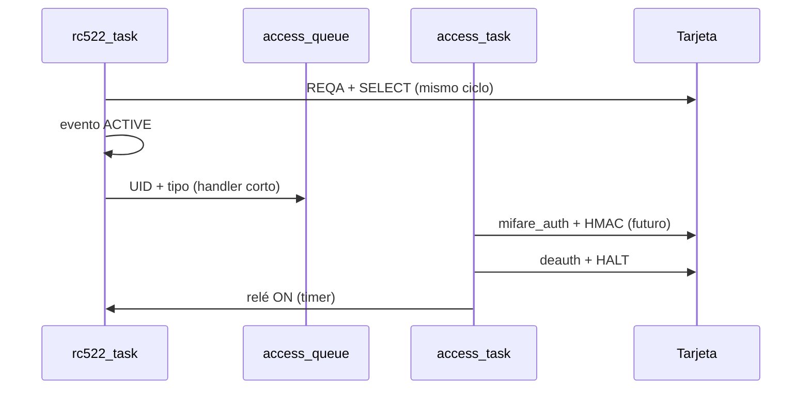

# Optimizaciones RC522 y diagnóstico de logs

Documento de **planificación**: describe mejoras posibles y cómo interpretar avisos del lector. No implica que todo esté ya implementado en firmware.

Relacionado: [sistema-cerradura-inteligente.md](./sistema-cerradura-inteligente.md).

---

## Códigos de error del componente (`0xF522` + offset)

| Código | Constante | Significado habitual |
| --- | --- | --- |
| `F523` | `RC522_ERR_COLLISION` | Colisión en REQA/anticolisión (campo vacío, ruido o tarjeta mal apoyada). **Normal al sondear**; no indica fallo si luego detecta la tarjeta. |
| `F526` | `RC522_ERR_INVALID_ATQA` | Respuesta REQA/WUPA no válida (clones, bits residuales) |
| `F527` | `RC522_ERR_RX_TIMEOUT` | Sin respuesta antes del deadline del bucle (~36 ms) |
| `F528` | `RC522_ERR_RX_TIMER_TIMEOUT` | Timer del MFRC522 expiró sin RX (campo vacío o tarjeta ya no en READY) |
| `F529` | `RC522_ERR_INVALID_SAK` | SAK/CRC incorrecto tras SELECT |
| `F52B` | `RC522_ERR_PCD_FIFO_BUFFER_OVERFLOW` | FIFO desbordado |
| **`F52C`** | **`RC522_ERR_PCD_PARITY_CHECK_FAILED`** | **Paridad incorrecta en la recepción (RF débil o ruido)** |
| `F52D` | `RC522_ERR_PCD_PROTOCOL_ERROR` | Error de protocolo en el registro ErrorReg |

---

## Aviso: `REQA failed while PICC state=IDLE (err=F52C)`

### Qué significa

En estado **IDLE** el task del RC522 envía **REQA** para detectar tarjetas. **`F52C` es fallo de paridad en la capa física**: el MFRC522 recibió algo en el aire pero los bits no pasaron el chequeo de paridad ISO 14443 Type A.

No es lo mismo que un timeout (`F527`/`F528`): aquí hubo actividad RF “sucia” o marginal, no un campo totalmente quieto.

### Causas típicas (orden práctico)

1. **Tarjeta en el borde del campo** o movimiento mientras se hace REQA.
2. **Ruido electromagnético**: relé, fuente del módulo relé, cables largos sin masa común, Wi‑Fi/BT del ESP32 cerca de la antena del RC522.
3. **Cableado**: MISO/MOSI/SCK demasiado largos o sueltos; 3,3 V inestable en el RC522 (muchos clones son sensibles).
4. **Varias tarjetas o metal** cerca de la antena (reflexiones).
5. **Clone RC522** con ganancia RX por defecto baja para tu bobina.

### ¿Es grave?

- **Un WARN aislado** mientras no hay tarjeta o al acercarla: suele ser **transitorio**; el siguiente ciclo de poll (50 ms) reintenta REQA.
- **WARN continuo** incluso con tarjeta quieta en el centro: revisar hardware y ganancia RX; valorar bajar SPI o subir ganancia.
- Si a pesar del WARN **sí ves** `Tarjeta detectada` y Auth OK, el sistema está funcionando; el log es ruidoso, no necesariamente un fallo funcional.

### Por qué sale como WARN y no como DEBUG

En `rc522.c` (parche local), REQA solo silencia en log los errores: timeout, colisión e INVALID_ATQA. **Paridad (`F52C`), FIFO y protocolo siguen en WARN**, aunque en campo vacío pueden ser tan frecuentes como un timeout.

**Optimización propuesta (firmware):** tratar `F52C`, `F52B` y `F52D` en REQA/WUPA como “esperables al sondear” → nivel DEBUG, igual que `F528`.

**Optimización propuesta (robustez):** 1–2 reintentos de REQA con `vTaskDelay(1–3 ms)` y, tras N fallos seguidos, `rc522_pcd_reset()` o soft-reset del PCD.

---

## Corrección ya aplicada: `select failed (err=F528)`

**Causa:** REQA pasaba la tarjeta a READY, pero **SELECT esperaba al `poll_interval`** (~120 ms por defecto). En ISO 14443 el estado READY es corto → timeout en SELECT.

**Cambio:** REQA/WUPA y SELECT en el **mismo ciclo** del task; `poll_interval_ms = 50` en `main.c`.

Si vuelve a aparecer `F528` en SELECT, revisar HALT/heartbeat y que ningún handler bloquee demasiado tiempo el task del RC522 (ver abajo).

---

## Optimizaciones recomendadas (prioridad)

### P0 — Fiabilidad “one shot” (acercar tarjeta → un acceso)

| # | Área | Problema | Propuesta |
| --- | --- | --- | --- |
| 1 | **Task RC522** | El handler `rc522_handler` corre en el **mismo contexto** que `rc522_task` (`esp_event_loop_run` tras cada evento). Auth MIFARE + `halta` **bloquean el sondeo** decenas de ms. | Encolar UID en una cola y procesar en **tarea `access_task`**; en el handler solo copiar datos. Opcional: `task_mutex` del RC522 — tomar mutex durante Auth/HALT (documentado en `rc522_config_t`). |
| 2 | **Logs REQA** | `F52C` en WARN ensucia el monitor. | Incluir paridad/protocolo/FIFO en la lista de errores “normales” en REQA/WUPA (DEBUG). |
| 3 | **Reintentos RF** | Un REQA fallido descarta el ciclo. | Reintento inmediato (máx. 2) antes de `continue`. |

### P1 — Hardware / RF

| # | Propuesta |
| --- | --- |
| 4 | Conectar **RST** del RC522 a un GPIO y usar reset duro tras rachas de errores (hoy `PIN_NUM_RST = -1`, solo soft-reset). |
| 5 | Tras `rc522_start`, llamar `rc522_pcd_set_rx_gain(..., RC522_PCD_43_DB_RX_GAIN)` o `48 dB` si la distancia tarjeta–antena es grande (probar sin saturar). |
| 6 | Mantener SPI en **1 MHz**; si persisten `F52C`/`F52B`, probar **500 kHz**. |
| 7 | Relé: diodo flyback, masa común RC522–ESP32, alejar antena del trazo del relé; no alimentar el RC522 desde el mismo borne ruidoso del relé sin filtrado. |

### P2 — Lógica de aplicación (`main.c`)

| # | Propuesta |
| --- | --- |
| 8 | **HMAC real:** leer 32 bytes del bloque 4 (o bloques 4–5), comparar con HMAC calculado; tras éxito, escribir nuevo token/nonce en tarjeta + NVS. Hoy el hash “recibido” se calcula en el ESP32 y siempre coincide si MIFARE Auth OK (ver doc del sistema). |
| 9 | Hasta tener (8): en producción, **omitir** `security_validate_and_update_card` con hash autogenerado o exigir solo MIFARE Auth para no dar falsa sensación de anti-replay. |
| 10 | **`format_mode`:** mover a NVS o GPIO de servicio, no recompilar para formatear. |
| 11 | Master key por defecto `0xAA…`: generar en primer arranque con `esp_fill_random` y guardar en NVS. |
| 12 | Tras acceso concedido, **no** llamar `halta` dos veces (handler duplicado + reentrada ACTIVE); unificar “sesión terminada” en un solo sitio. |

### P3 — Rendimiento y mantenimiento

| # | Propuesta |
| --- | --- |
| 13 | `poll_interval_ms`: 50 ms es el mínimo del componente; **80–100 ms** puede reducir REQA fallidos si no hay prisa en detectar. |
| 14 | Heartbeat con umbral `2 × task_delay_ms` (100 ms): si Auth tarda más, puede forzar IDLE prematuro; subir umbral o pausar heartbeat mientras `access_task` tiene la tarjeta. |
| 15 | Evitar parches en `managed_components/`; fork del componente o `idf_component.yml` con ruta local para que `pio run` no los pierda. |
| 16 | Deep sleep + wake en GPIO (botón) si más adelante hay batería; hoy alimentación USB es aceptable. |

---

## Flujo objetivo tras P0

---

## Checklist de verificación en banco

1. Sin tarjeta: idealmente **sin WARN** repetidos cada 50 ms (tras silenciar F52C/F528 en poll).
2. Una pasada de tarjeta Classic formateada: un log `Tarjeta detectada`, Auth OK, `ACCESO CONCEDIDO`, relé 2 s, un HALT OK.
3. Misma tarjeta sin retirar: no debe spamear Auth; HALT o ignore UID repetido.
4. Retirar tarjeta: un `Tarjeta retirada` (si hubo sesión previa).
5. Tarjeta sin clave / NTAG: denegado claro, sin bloquear el lector.

---

## Próximo paso sugerido (cuando pidas implementación)

1. Silenciar REQA/WUPA para `F52C` / `F52B` / `F52D` + reintento corto de REQA.
2. Mover Auth/HALT a `access_task` + mutex RC522.
3. (Opcional) ganancia RX 43 dB y GPIO RST.

No cambiar cableado ni seguridad MIFARE hasta confirmar que el flujo one-shot es estable en logs.
